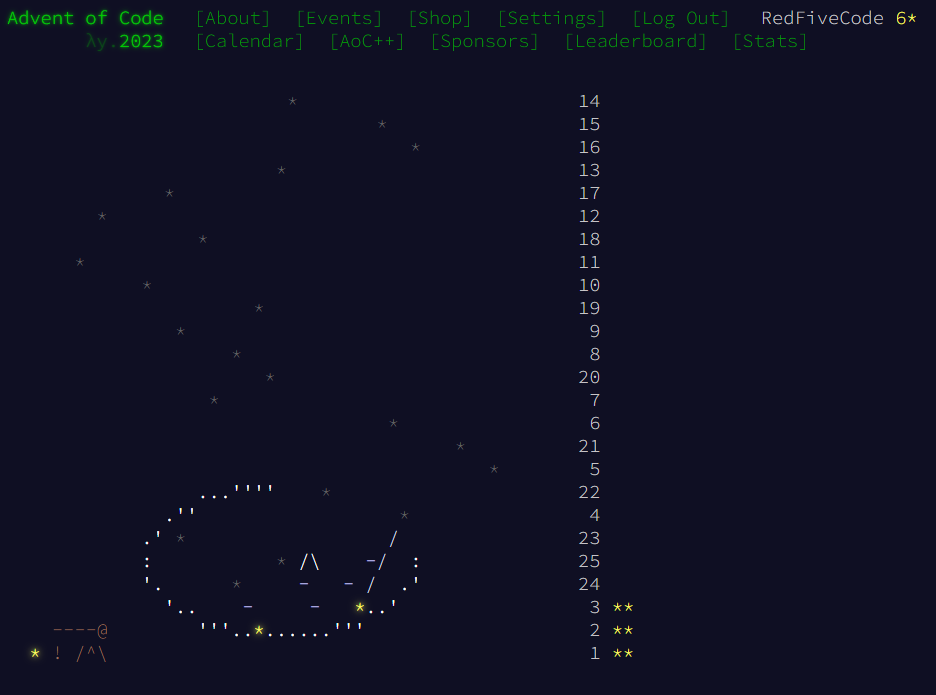

# Advent of Code 2023

My solutions to the [Advent of Code 2023](https://adventofcode.com/2023).

## Summary
C#, both for .net framework 4.8 and .net 7.0.
With unit tests.
Time did not allow me to compete much at all on this occasion.

* [Day 1: Trebuchet?!](https://adventofcode.com/2023/day/1) :star: :star:
* [Day 2: Cube Conundrum](https://adventofcode.com/2023/day/2) :star: :star:
* [Day 3: Gear Ratios](https://adventofcode.com/2023/day/3) :star: :star:

6 :star:

## Author and License
RedFiveCode (https://github.com/RedFiveCode)

Copyright (c) © 2023 RedFiveCode (https://github.com/RedFiveCode) All rights reserved.

Released under MIT License (see License file).